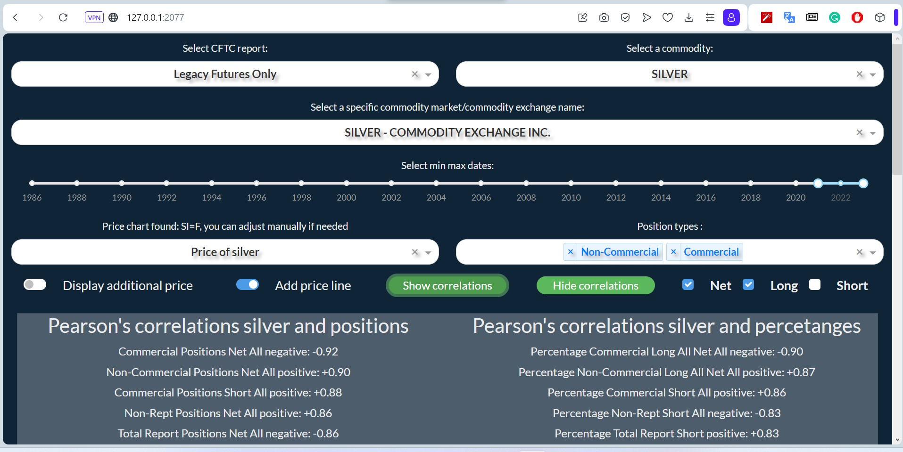
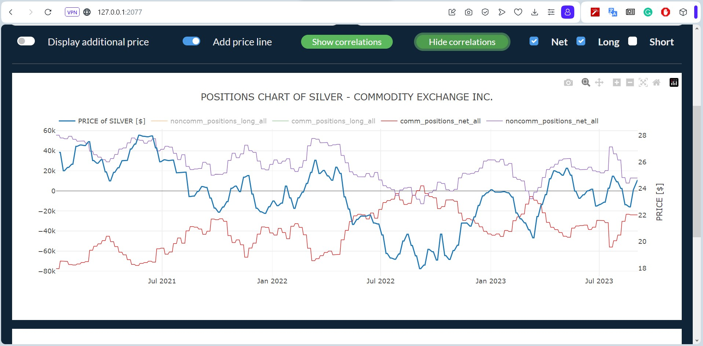

<a name="readme-top"></a>

<div align="center">

  <h1 align="center">Positions Explorer: Unveiling Commitment of Traders Reports</h1>

  <p align="center">
    Unearth speculative trading positions across markets with data from the United States Commodity Futures Trading Commission (CFTC)
    <br />
    <a href="https://github.com/MarcinLinkl/Positions-CoT-Explorer"><strong>Explore the documentation »</strong></a>
    <br />
    <br />
    <!-- <a href="https://github.com/MarcinLinkl/Positions-CoT-Explorer">View Demo</a>
    · -->
    <a href="https://github.com/MarcinLinkl/Positions-CoT-Explorer/issues">Report Bug</a>
    ·
    <a href="https://github.com/MarcinLinkl/Positions-CoT-Explorer/issues">Request Feature</a>
  </p>
</div>

## Table of Contents
- [About the Project](#about-the-project)
  - [Application Overview](#application-overview)
  - [Charts: Visualizing Price Positions](#charts-visualizing-price-positions)
  - [Understanding CFTC and CoT Reports](#understanding-cftc-and-cot-reports)
  - [Trading Position Reports](#trading-position-reports)
  - [Use Cases](#use-cases)
  - [Running App](#Running the Application)
- [Tech Stack](#tech-stack)

## About the Project

### Application Overview
Choose a report, commodity group, and commodity/exchange name. The "Select Price" dropdown will populate automatically.

___The application showcases silver correlations (Pearson's) between prices and assets in futures contracts positioning for Commercial and Non-Commercial groups for net (long side minus shorts) and long positions.___<br>
Brief description: _Commercial net positions demonstrate the most pronounced negative correlation with price and asset positions, whereas Non-Commercial net positions exhibit the most significant positive correlation among the different groups._



### Charts: Visualizing Price 

The chart depicts the involvement of two major player groups: Commercial entities (silver producers) and Non-Commercial traders (speculators).


Explanation: _When the net futures positions of the Commercial Group (producers) turn negative, it indicates an uptick in their hedging activities in anticipation of declining prices. In such situations, these entities take precautionary steps to protect their interests. As a result, it can be advantageous to contemplate asset purchases when their positions are significantly high, as this demonstrates a negative correlation.<br>
Conversely, non-commercial entities often witness their positions expanding as prices rise. The relatively limited net positions held by this group suggest that it might be an opportune moment to consider buying, as these positions align with potential upward price trends. These substantial funds are exceptionally well-informed and have conducted extensive predictive price research since their interests are primarily speculative, thereby rendering price movements highly correlated with this group of traders._


### Understanding CFTC and CoT Reports

The **Commodity Futures Trading Commission** (CFTC) is an independent agency of the United States government responsible for regulating commodity futures, options, and swaps markets. The CFTC was established in 1974 through the Commodity Futures Trading Commission Act.
The **Commitments of Traders**, known as **CoT**, is a weekly market report where 20 or more traders hold positions equal to or above the reporting levels set by the **CFTC**. It is released every Friday at 3:30 p.m. ET and reflects traders' commitments on the prior Tuesday.

### Trading Position Reports

This section offers an overview of different trading position reports.

#### 1. Legacy Reports

Legacy reports provide a breakdown of trading positions by exchange, including both futures-only and combined futures and options positions. Reportable open interest positions in Legacy reports are classified into two categories:

1. Non-Commercial
2. Commercial Traders (Large Hedgers)

The original COT reports, dating back for most futures contracts to the 1980’s. For trading purposes, these reports are the most useful, because of their long history and proven edge.

#### 2. Disaggregated Reports

Since October, 2009, two new types of COT reports are published, one of them is the Disaggregated report. The new report practically breaks down the Legacy report's Commercial category into smaller, more uniform pieces. Here are the categories explained:

1. __Producer/Merchant/Processor/User__:
companies that produce, process, pack or handle the physical commodity and use the futures markets to hedge price risks.

2. __Swap dealer__:
uses the futures markets to hedge price risks related to swaps. These traders may well be connected to speculative traders - this is the reason why the new category was needed. In most cases it is unknown that the counterparty is really a hedge fund or a commercial producer/processor.

3. __Money manager__:
a registered Commodity Trading Advisor (CTA), a Commodity Pool Operator (CPO) or an unregistered fund identified by the CFTC.

4. __Other reportables__:
large traders, effectively speculators, who cannot be classified in the above categories.
#### 3. Traders in Financial Futures (TFF) Reports

The Traders in Financial Futures (aka TIFF) report is a new report, its publication started in 2010, together with the Disaggregated COT reports. The philosophy behind these reports is the same as in case of Disaggregated data: to break down big trader categories into smaller, and more homogenous sub-parts. In case of financial futures, we cannot really speak of "producers" and "processors", on the other hand we can divide the users of these markets. Here are the categories explained:

1. __Dealer/Intermediary:__
typical 'sell side' companies, which sell financial products to clients and hedge their risks with futures contracts. They are not on the market to speculate, their main intention is to sell their price risk.

2. __Asset Manager/Institutional__:
institutional investors like pension and mutual funds, endowments, insurance companies.

3. __Leveraged Funds__:
typically hedge funds, including Commodity Trading Advisors (CTAs), Commodity Pool Operator (CPOs) and propriatery traders, also trading on behalf of clients.

4. __Other reportables__:
large traders which do not fit it the above three categories. Typically corporate treasuries, central banks, smaller banks, credit unions, mortgage originators.

#### 4. Supplemental Reports

The Supplemental report covers 13 selected agricultural commodity contracts for combined futures and options positions, with a specific focus on the agricultural sector.
Has more history than the disaggregated reports, but still not enough, especially compared to the depth of the legacy reports. It was constructed to show the positions of commodity investment (commodity index tracking) funds. I removed this report from the application because it has the lowest trading value, and at this moment, Socrata is providing very confusing and incomplete data.
### Use Cases

Trading position reports serve various purposes in financial and commodities markets:

1. **Risk Management:** Commercial traders ("hedgers") use reports to manage their exposure to price fluctuations. Analyzing commercial traders' positions provides insights into how they are positioning themselves to handle market risks.

2. **Speculative Insights:** Non-commercial traders ("large speculators") offer insights into speculative market sentiment. Their positions help traders and investors understand trends and make informed decisions.

3. **Price Forecasting:** Positions of both commercial and non-commercial traders can indicate potential price movements. Commercial traders' positions reflect potential supply and demand dynamics, while non-commercial traders' positions signal market trends.

4. **Market Analysis:** Reports are valuable for comprehensive market analysis. Studying positions by different trader types provides insights into market participants' behaviors and expectations.

<p align="right">(<a href="#readme-top">back to top</a>)</p>

### Running the Application

To run the Positions CoT Explorer locally, follow these steps:

Clone the Repository
```
git clone https://github.com/MarcinLinkl/Positions-CoT-Explorer
cd Positions-CoT-Explorer
```
Create a Virtual Environment (Recommended)
```
python -m venv venv
source venv/bin/activate  # On Windows use `venv\Scripts\activate`
```
Install Dependencies

```
pip install -r requirements.txt
```
Run the Application
```
py dashboard.py
```
By default, the application will be accessible at http://127.0.0.1:2077 in your web browser. You can change port if needed ;)


## Tech Stack

The application is powered by a combination of libraries, tools, and frameworks:

- : A Python framework for building interactive web applications for data visualization.
- : Extends Dash with Bootstrap components for responsive designs.
- : A lightweight, serverless database engine for data storage.
- : A powerful data manipulation and analysis library for Python.
- : Fetch financial data from Yahoo Finance.
- Custom Python scripts, like `utils.py` and `ticker_finder.py`, enhance functionality.
- : Local database (`data.db`) for storing application data.
- : Fetch relevant data.
- `reports_cols.py`: Custom report definitions for structuring and managing data.
- `fetch_data.py`: [Socrata API](https://dev.socrata.com/) for data retrieval and filtering by most available.
- `ticker_finder.py`: Script to find and manage tickers.
- `utils.py`: Contains functions for updating callbacks within the menu, enhancing user interaction with our application.
- `data_operations.py`: Houses scripts responsible for identifying correlations between prices and positions, as well as generating graphs. This file is a critical component of our application, facilitating data analysis and visualization. 
- `yahoo_tk_futures.json`: A JSON file that holds information about financial futures instrument tickers available on Yahoo Finance. This serves as a data source that enriches our financial data offerings.You can easly update it for specific ticker yfinnace values.
- `dashboard.py`: The main execution program for our interactive dashboard.

<p align="right">(<a href="#readme-top">back to top</a>)</p>
